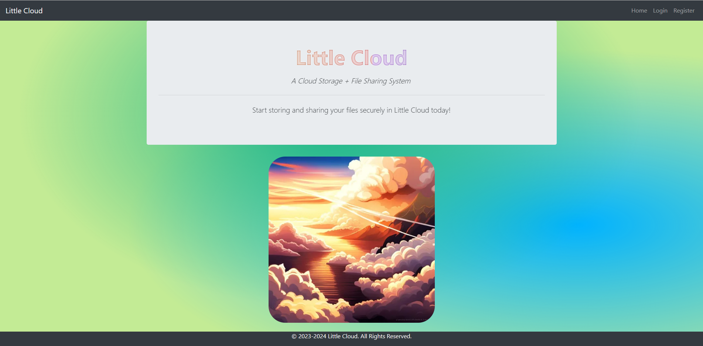
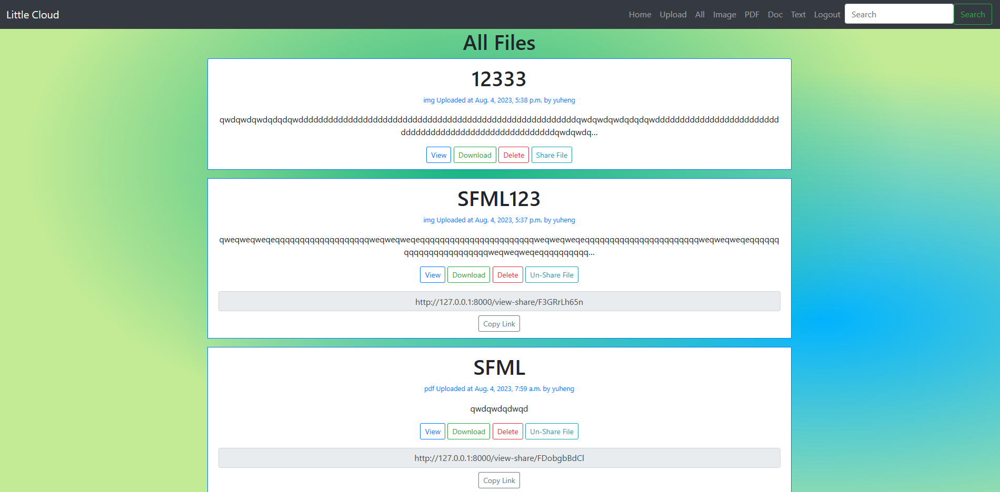
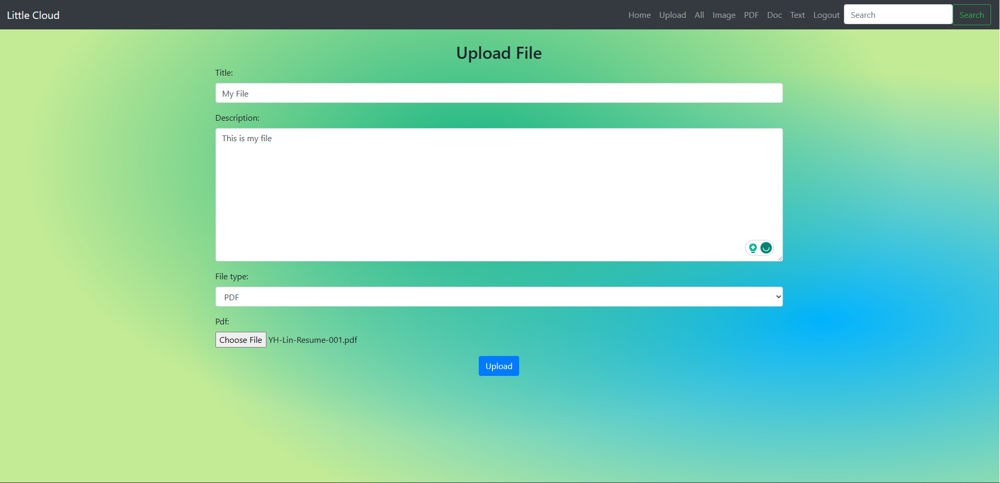
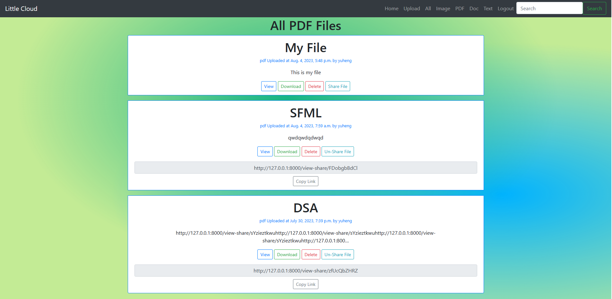
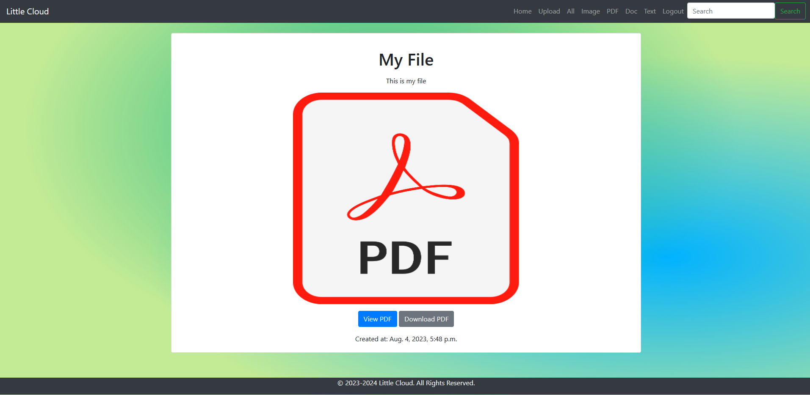
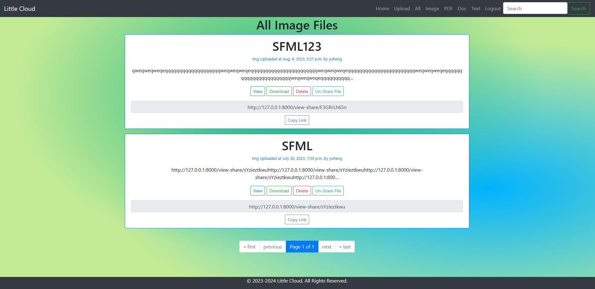

# Little Cloud
Little Cloud is a powerful Cloud Storage and File Sharing System built using Django, Bootstrap, HTML,
and SQLite. With its intuitive interface and feature-rich functionalities, it provides a seamless experience
for managing and sharing files in the cloud.

## Demo
* Home Page

* View All Files After Login

* File Upload

* View Files By Category

* View Shared Files

* Search Files Under Current Category

## General Design Flow:
https://docs.google.com/document/d/151UgRyzX1GIQnWgQZXjd5QYPJwO0W-ZCCpm5zK5xot8/edit?usp=sharing

## System Setup
To run this project run the command 'pip install -r requirements.txt'
